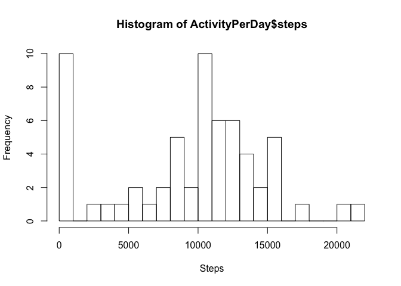
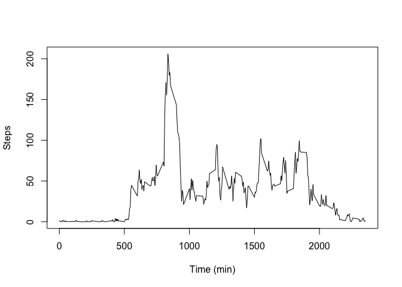
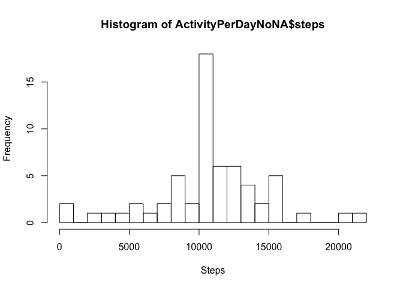
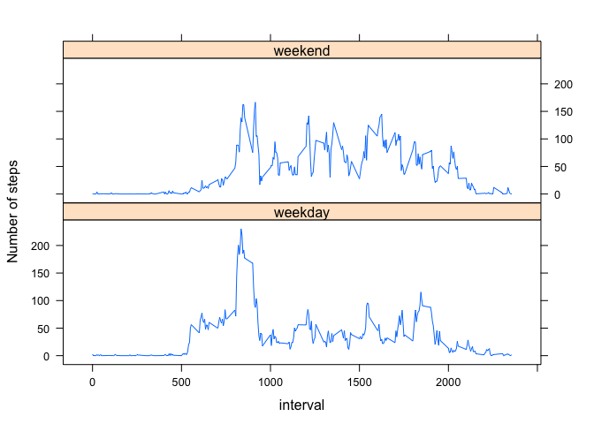

## Loading and preprocessing the data

The first step is to unzip the file and read the content of 'activity.csv'


```r
unzip("activity.zip")
activity <- read.csv("activity.csv")
```

No preprocessing is necessary at this stage

## What is mean total number of steps taken per day?

This question is answered by plotting a histogram of the frequency of days during which a specific number of steps has been achieved.

The "dplyr" library is used for the "group_by" function.


```r
library(dplyr)
ActivityPerDay <- summarize(group_by(activity, date), steps = sum(steps, na.rm = TRUE))
hist(ActivityPerDay$steps, breaks =20, xlab = "Steps")
```

<!-- -->

Computation of the mean number of steps per day.


```r
mean(ActivityPerDay$steps)
```

```
## [1] 9354.23
```

Computation of the median number of steps per day.


```r
median(ActivityPerDay$steps)
```

```
## [1] 10395
```

## What is the average daily activity pattern?

The question is answered by a making a time series plot of the average number of steps taken.

The first step is to average the number of steps taken per interval 


```r
ActivityPerInterval <- summarize(group_by(activity, interval), steps = mean(steps, na.rm = TRUE))
```

The plot below shows the daily activity pattern, averaged over the whole length of the study. 


```r
plot(ActivityPerInterval$interval, ActivityPerInterval$steps, type = "l", xlab = "Time (min)", ylab = "Steps") 
```

<!-- -->

The code below computes the 5-minute interval that, on average, contains the maximum number of steps


```r
ActivityPerInterval[which(ActivityPerInterval$steps == max(ActivityPerInterval$steps)),1]
```

```
## # A tibble: 1 x 1
##   interval
##      <int>
## 1      835
```

This seems to correspond to the maximum shown of the previous graph.

## Code to describe and show a strategy for imputing missing data

Number of rows that contain NA values


```r
sum(is.na(activity$steps))
```

```
## [1] 2304
```

Percentage of rows that contain NA values


```r
100 * sum(is.na(activity$steps)) / nrow(activity)
```

```
## [1] 13.11475
```

As this percentage might influence the results, let's replace the NA values with the average number of steps for that specific interval over all the days of the study


```r
activityNoNA <- activity
for(i in 1:nrow(activity)) {
        if(is.na(activity$steps[i] == TRUE)) {
                activityNoNA$steps[i] <- ActivityPerInterval$steps[which(ActivityPerInterval$interval == activity$interval[i])]
        }
}
```


## Histogram of the total number of steps taken each day after missing values are imputed

This plot represents the frequency of days during which a specific number of steps has been achieved, using the new dataset without NA values


```r
ActivityPerDayNoNA <- summarize(group_by(activityNoNA, date), steps = sum(steps))
hist(ActivityPerDayNoNA$steps, breaks =20, xlab = "Steps")
```

<!-- -->

Computation of the mean number of steps per day


```r
mean(ActivityPerDayNoNA$steps)
```

```
## [1] 10766.19
```

Computation of the median number steps per day


```r
median(ActivityPerDayNoNA$steps)
```

```
## [1] 10766.19
```

## Are there differences in activity patterns between weekdays and weekends?

We'll answer this question by comparing the average number of steps taken per 5-minute interval across weekdays and weekends using a panel plot 

First step is to create a new factor variable in the dataset with two levels – “weekday” and “weekend” indicating whether a given date is a weekday or weekend day.


```r
for(i in 1:nrow(activityNoNA)) {
        if(weekdays(as.Date(activityNoNA$date[i],"%Y-%m-%d")) == "Saturday" | weekdays(as.Date(activityNoNA$date[i],"%Y-%m-%d")) == "Sunday") {
                activityNoNA$type[i] <- "weekend"
        }
        else { 
                activityNoNA$type[i] <- "weekday"
        }
}
```


Average the number of steps taken per interval for weekdays


```r
ActivityPerIntervalWeekday <- activityNoNA %>% group_by(interval, type) %>%  summarize(steps = mean(steps, na.rm = TRUE))
```

Producing the panel plot


```r
library(lattice)
xyplot(steps ~ interval | type, data = ActivityPerIntervalWeekday, type = "l" ,layout = c(1, 2), ylab = "Number of steps")
```

<!-- -->
